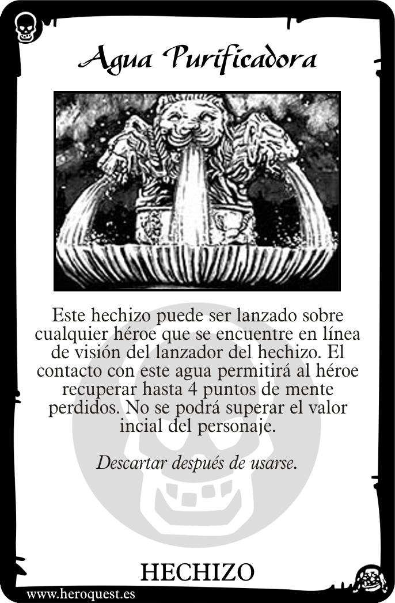
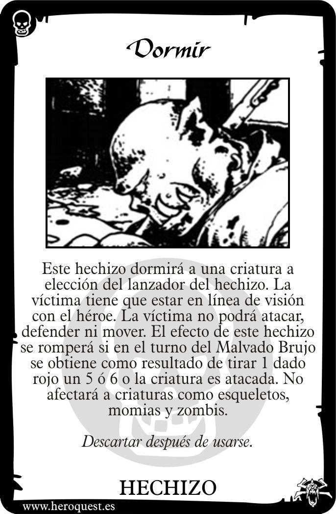
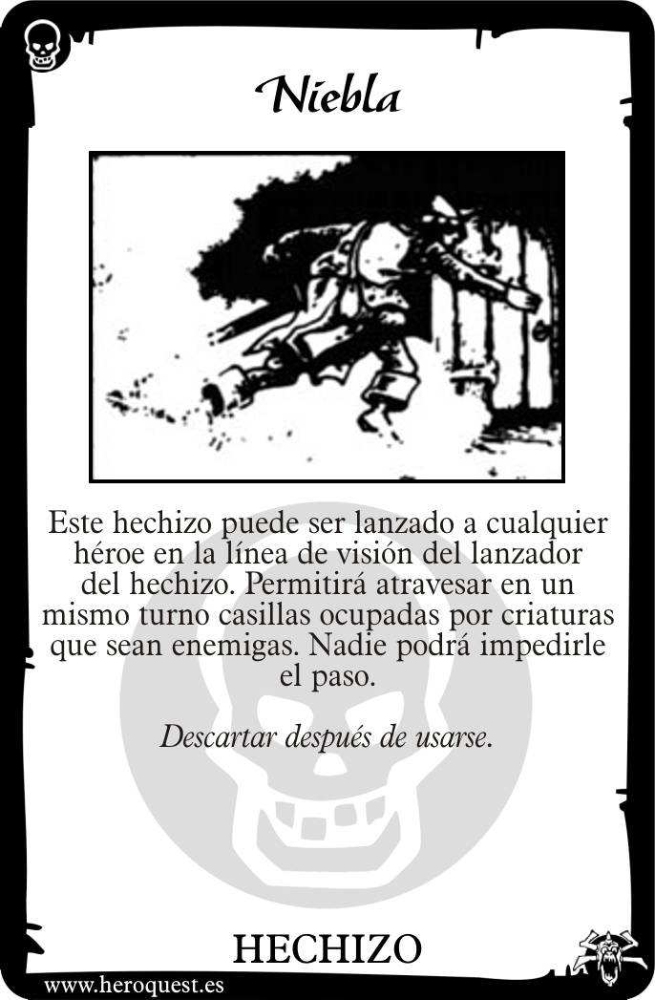

# 💧 Hechizos de Agua (Water Spells)

El agua fluye y se adapta, ofreciendo tanto curación como estados de alteración mental. Es el elemento de la purificación y el sueño profundo.

---

## 📜 Lista de Cartas de Hechizos

### 1. Agua de Curación (Water of Healing)
**Texto de la Carta:**
> "Este hechizo restaura hasta 4 Puntos de Cuerpo de cualquier héroe al que el lanzador pueda 'ver'. No puede ser usado para aumentar el número total de Puntos de Cuerpo iniciales."

**Explicación y Reglas:**
- **Distancia:** A diferencia de otros hechizos corporales, requiere línea de visión. Es la contraparte líquida de la *Cura Corporal* de Tierra.
- **Uso Crítico:** Úsalo para mantener al grupo en pie sin necesidad de que el Mago se acerque demasiado al peligro.

---

### 2. Dormir (Sleep)
**Texto de la Carta:**
> "Este hechizo puede lanzarse sobre un monstruo. Si el monstruo tiene menos de 4 Puntos de Mente, no podrá atacar, defenderse ni moverse durante un turno. Despertará si se le ataca o si saca una calavera al inicio de su turno."

**Explicación y Reglas:**
- **Control de Masas:** Ideal para anular a un monstruo poderoso (como un Fimir o un Guerrero del Caos) mientras el grupo se encarga de los esbirros.
- **Limitación de Mente:** Algunos jefes tienen alta Mente y son inmunes. Los esqueletos y zombies también pueden tener reglas específicas de inmunidad según la versión.

---

### 3. Velo de Niebla (Veil of Mist)
**Texto de la Carta:**
> "Este hechizo puede lanzarse sobre el lanzador o cualquier héroe al que pueda ver. Ese héroe podrá mover a través de casillas ocupadas por monstruos la siguiente vez que se mueva."

**Explicación y Reglas:**
- **Movimiento Evasivo:** Permite escapar de estar rodeado o atravesar una barrera de orcos para alcanzar un objetivo prioritario o un tesoro.
- **Táctica:** No permite detenerse en la misma casilla que un monstruo, solo pasar por ella.

---

## 💡 Consejos del Mago
El Agua es la elección preferida de los Magos que juegan de forma defensiva o de apoyo. *Agua de Curación* es casi obligatorio en grupos sin muchas pociones. *Dormir* es un salvavidas cuando una habitación se complica.

---
*Material generado en base a los manuales clásicos y el sistema de juego Heroquest 2021.*

