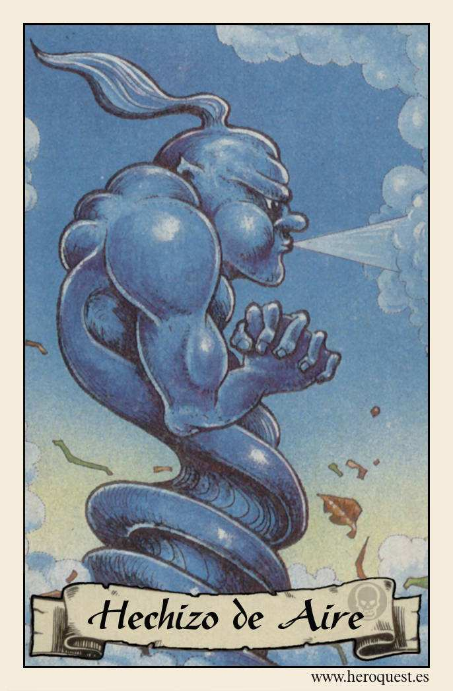
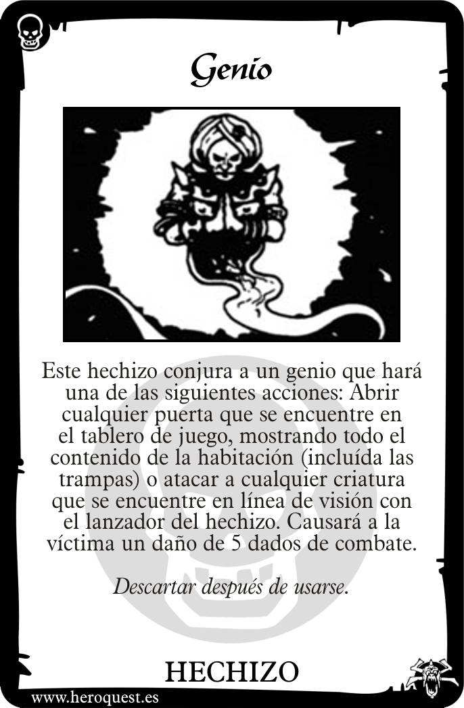
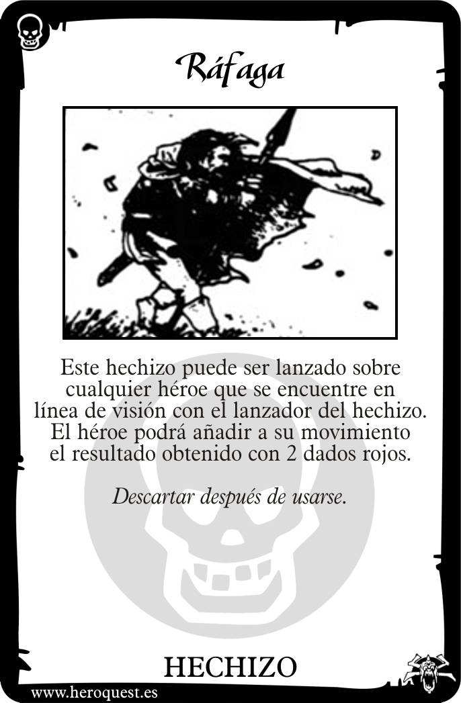
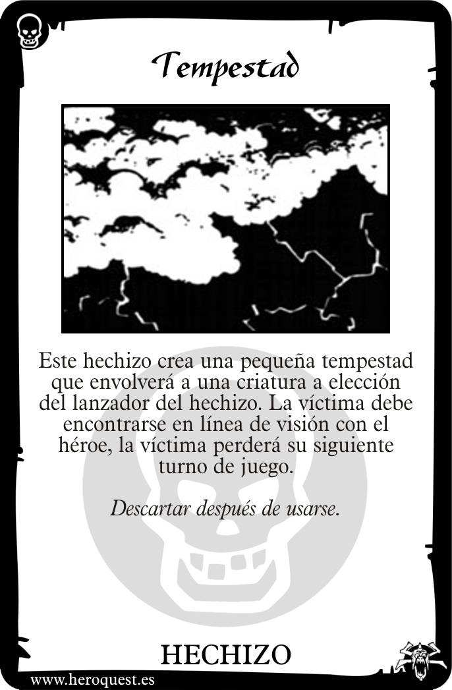

# 💨 Hechizos de Aire (Air Spells)

La magia del aire es volátil, rápida y poderosa. Se centra en el movimiento veloz y en la invocación de fuerzas elementales.

---

## 📜 Lista de Cartas de Hechizos

### 1. Genio (Genie)
**Texto de la Carta:**
> "Este hechizo conjura a un genio que hará una de las siguientes acciones: Abrir cualquier puerta que se encuentre en el tablero, o atacar a cualquier criatura que se encuentre en línea de visión con 5 dados de combate."

**Explicación y Reglas:**
- **Versatilidad:** Es uno de los hechizos de ataque más poderosos (5 dados).
- **Exploración Segura:** Abrir una puerta a distancia permite ver qué hay dentro sin exponerse a emboscadas o trampas de entrada.
- **Defensa del Monstruo:** El objetivo se defiende normalmente, pero ante 5 dados, pocos sobreviven.

---

### 2. Viento Veloz (Swift Wind)
**Texto de la Carta:**
> "Este hechizo puede lanzarse sobre cualquier héroe. Ese héroe podrá tirar el doble de dados para su movimiento en su siguiente turno."

**Explicación y Reglas:**
- **Movilidad Extrema:** Permite cruzar el tablero de punta a punta. Ideal para llegar a una salida antes de que se cierre o para huir de una situación comprometida.
- **Sinergia:** Úsalo con el Enano para compensar su movimiento lento o con el Mago para situarse en una posición de disparo segura.

---

### 3. Tempestad (Tempest)
**Texto de la Carta:**
> "Este hechizo envuelve a un monstruo en un torbellino. El monstruo pierde su siguiente turno y no podrá atacar ni moverse."

**Explicación y Reglas:**
- **Aturdimiento:** A diferencia de *Dormir*, no tiene restricción de puntos de Mente. Es efectivo contra casi cualquier enemigo.
- **Tiempo:** Gana un turno entero para que el grupo se reposicione o lo golpee sin miedo a represalias inmediatas.

---

## 💡 Consejos del Mago
El Aire es para el Mago ofensivo y táctico. El *Genio* es tu "botón del pánico" contra enemigos grandes, mientras que *Viento Veloz* asegura que nunca te quedes atrás en la carrera por el tesoro.

---
*Material generado en base a los manuales clásicos y el sistema de juego Heroquest 2021.*

