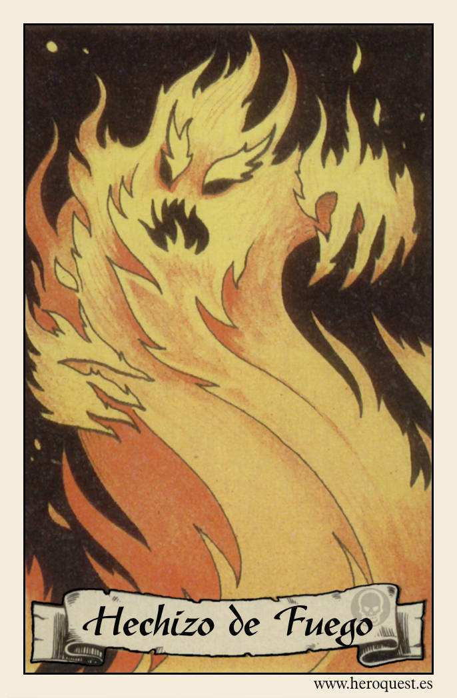
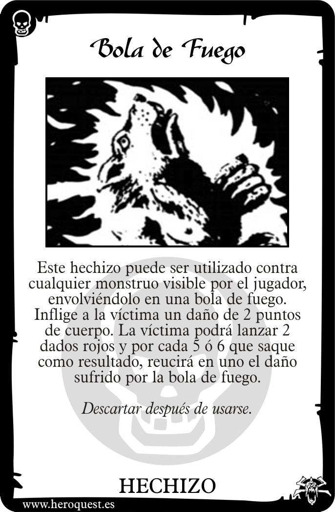
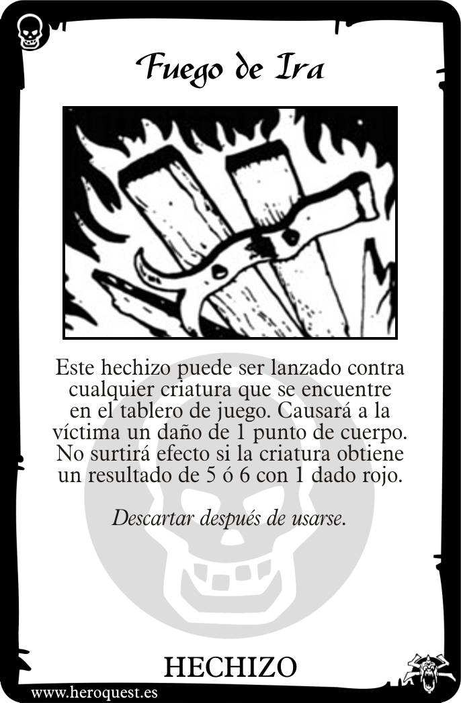
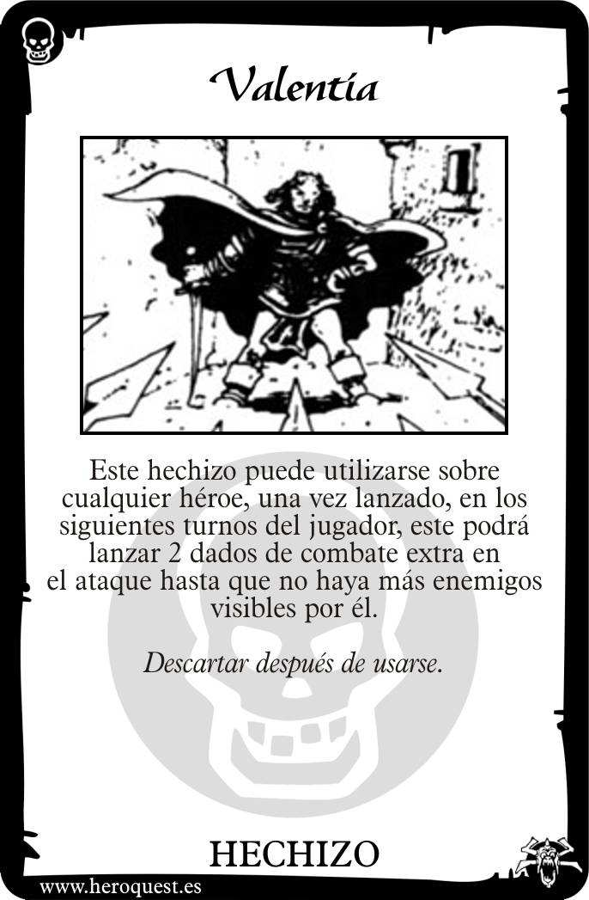

# 🔥 Hechizos de Fuego (Fire Spells)

Los Hechizos de Fuego son conocidos por su capacidad destructiva y su poder para infundir valor en los corazones de los héroes. Representan la fuerza del sol, la destrucción de la llama y el calor de la batalla.

---

## 📜 Lista de Cartas de Hechizos

### 1. Bola de Fuego (Fireball)
**Texto de la Carta:**
> "Este hechizo puede lanzarse a cualquier monstruo dentro de la línea de visión del lanzador. El monstruo y todos los que se encuentren en las casillas adyacentes a él sufren 2 dados de daño. Los monstruos no pueden defenderse de este ataque."

**Explicación y Reglas:**
- **Daño Directo:** A diferencia de un ataque normal, el defensor no tira dados de defensa. El daño es automático y se basa en la potencia de la llama.
- **Área de Efecto (AoE):** La explosión afecta a la casilla objetivo y a las 8 casillas que la rodean. Es ideal para limpiar grupos de Goblins o Esqueletos.
- **Peligro:** ¡Cuidado! Si un héroe está adyacente al monstruo, también recibirá el daño. El fuego no distingue amigos de enemigos.

---

### 2. Fuego de Ira (Fire of Wrath)
**Texto de la Carta:**
> "Este hechizo puede lanzarse sobre un monstruo o enemigo. Este perderá 2 Puntos de Cuerpo. Este hechizo no tiene efecto si el monstruo o enemigo saca un escudo blanco en su tirada de dados de defensa."

**Explicación y Reglas:**
- **Mecánica de Defensa:** El enemigo tira un solo dado de defensa. Si sale un escudo de héroe (blanco), el hechizo se disipa sin efecto. Si no, recibe 2 puntos de daño directo.
- **Uso Estratégico:** Es excelente para rematar a monstruos con pocos puntos de vida pero alta defensa, como el Guerrero del Caos o una Gárgola.

---

### 3. Valentía (Courage)
**Texto de la Carta:**
> "El héroe sobre el que se lanza este hechizo puede tirar 2 dados de combate adicionales la próxima vez que ataque. El hechizo se rompe en el momento en que se realiza el ataque."

**Explicación y Reglas:**
- **Potenciador de Combate:** Añade 2 dados extra a la tirada de ataque del guerrero elegido. Es especialmente poderoso cuando se lanza sobre el Bárbaro armado con un Hacha de Batalla.
- **Duración:** El efecto dura hasta el próximo ataque del héroe, sin importar cuántos turnos pasen. Sin embargo, una vez realizado el ataque, el efecto desaparece.

---

## 💡 Consejos del Mago
El fuego es una herramienta de doble filo. Mientras que la *Bola de Fuego* puede despejar una habitación, el uso de *Valentía* en el momento adecuado puede cambiar las tornas de un combate contra un jefe final. Recuerda que los hechizos de fuego son generalmente de un solo uso por reto, ¡úsalos con sabiduría!

---
*Material generado en base a los manuales clásicos y el sistema de juego Heroquest 2021.*

