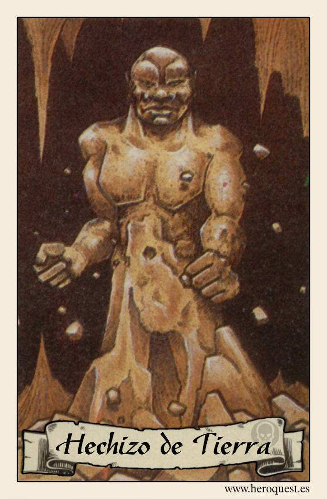
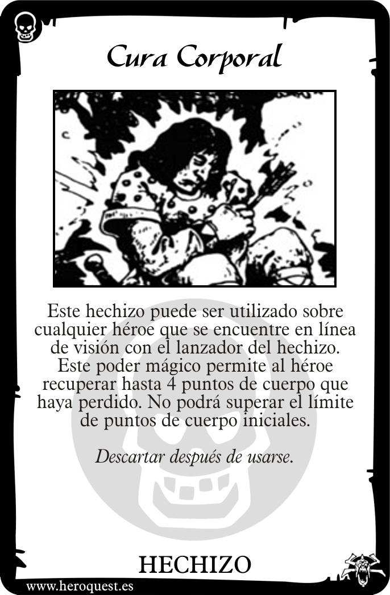
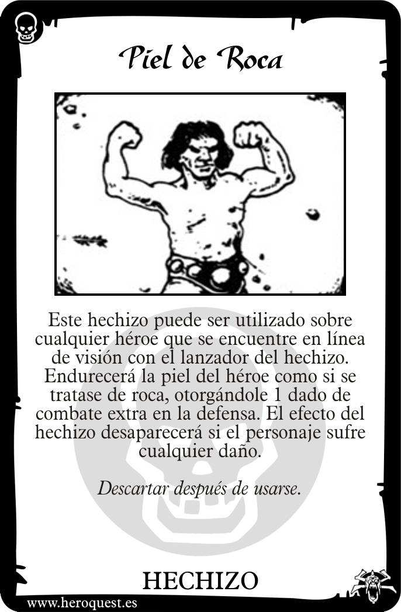
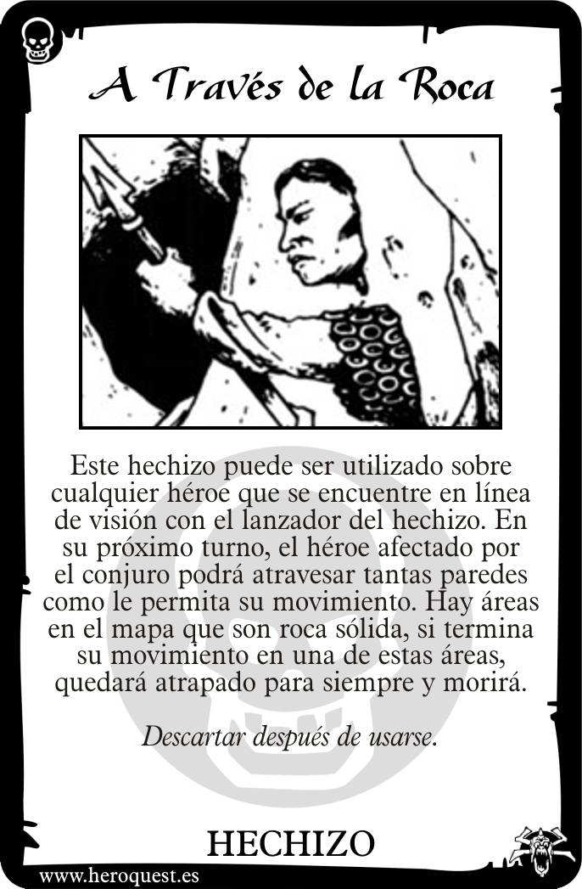

# 🪨 Hechizos de Tierra (Earth Spells)

La magia de la tierra se centra en la resistencia, la curación y la manipulación de la estructura del calabozo. Es el elemento de la estabilidad y la fuerza física.

---

## 📜 Lista de Cartas de Hechizos

### 1. Cura Corporal (Heal Body)
**Texto de la Carta:**
> "Este hechizo permite al lanzador restaurar hasta 4 Puntos de Cuerpo perdidos de cualquier héroe, incluido él mismo. No se puede exceder el valor inicial de Puntos de Cuerpo del personaje."

**Explicación y Reglas:**
- **Recuperación Vital:** Es el hechizo de curación más potente de la Tierra. Ideal para usarlo cuando un héroe está a punto de sucumbir.
- **Limitación:** Solo restaura puntos perdidos. No aumenta la salud máxima.

---

### 2. Piel de Roca (Rock Skin)
**Texto de la Carta:**
> "El héroe sobre el que se lanza este hechizo tendrá 2 dados de defensa adicionales hasta que reciba 1 Punto de Cuerpo de daño o hasta que termine el reto."

**Explicación y Reglas:**
- **Defensa Impenetrable:** Convierte a un héroe en un tanque. Es preferible lanzarlo al principio de un combate intenso sobre el personaje que esté en primera línea.
- **Duración Condicional:** El hechizo es muy duradero siempre que el héroe logre defenderse con éxito. En el momento en que atraviesen su defensa y pierda salud, la "piel" se agrieta y el efecto desaparece.

---

### 3. A Través de la Roca (Pass Through Rock)
**Texto de la Carta:**
> "El héroe sobre el que se lanza este hechizo puede moverse a través de paredes y obstáculos sólidos una vez por turno. El hechizo dura un número de turnos igual a los puntos de Mente del lanzador."

**Explicación y Reglas:**
- **Infiltración:** Permite cruzar muros hacia pasillos no explorados o habitaciones cerradas.
- **Riesgo:** Si un héroe termina su movimiento dentro de una pared, morirá instantáneamente. Es vital calcular bien los puntos de movimiento antes de usarlo.

---

## 💡 Consejos del Mago
El Mago a menudo se ve en la disyuntiva de elegir Tierra por su *Cura Corporal*. En misiones de larga duración, la *Piel de Roca* puede evitar mucha más pérdida de vida que la que cualquier cura puede sanar. ¡La prevención es la mejor medicina en la mazmorra!

---
*Material generado en base a los manuales clásicos y el sistema de juego Heroquest 2021.*

