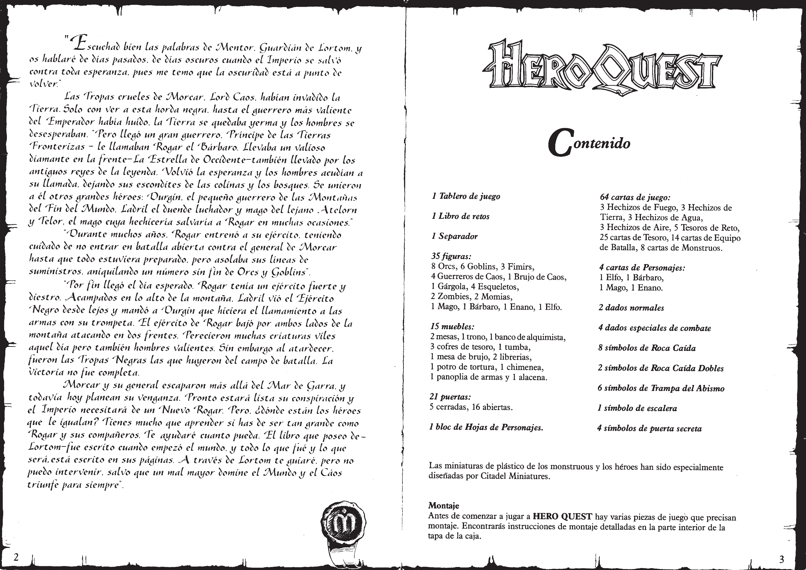
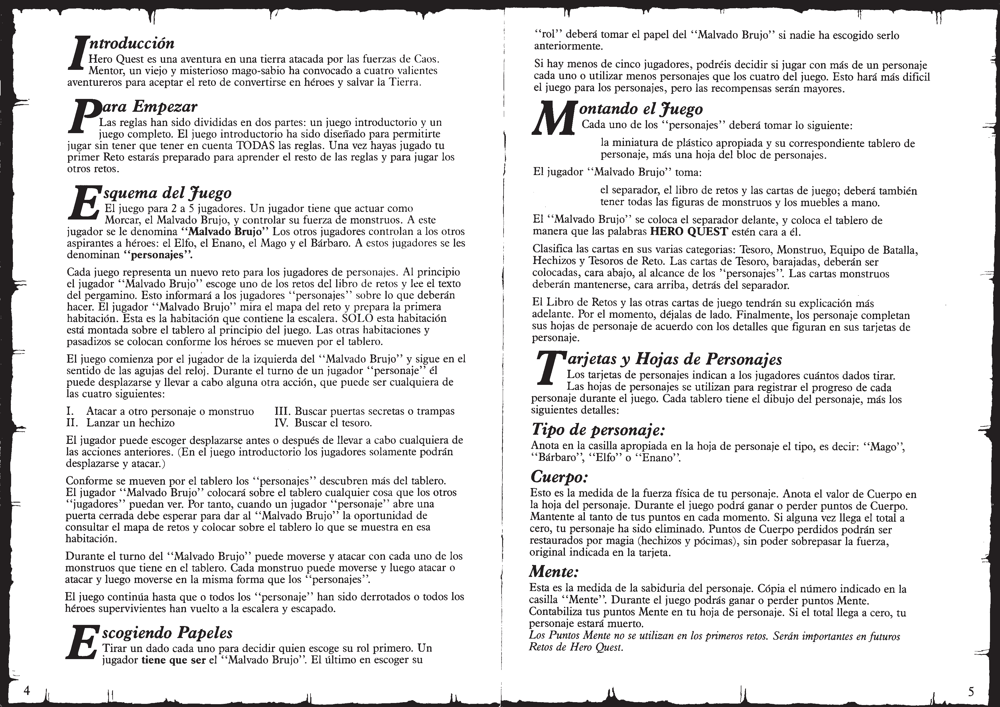
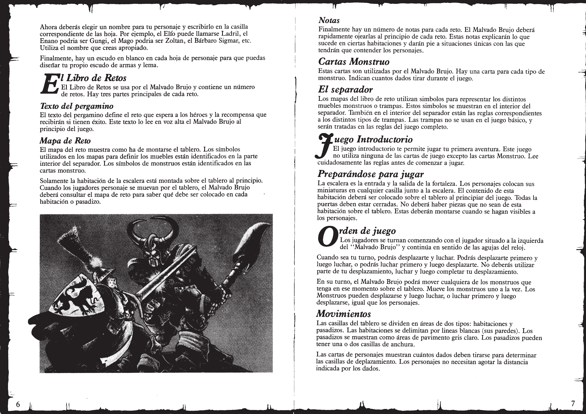
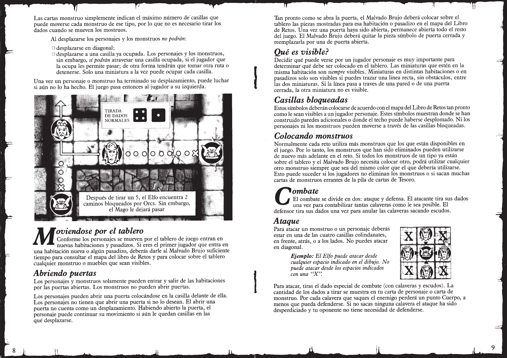
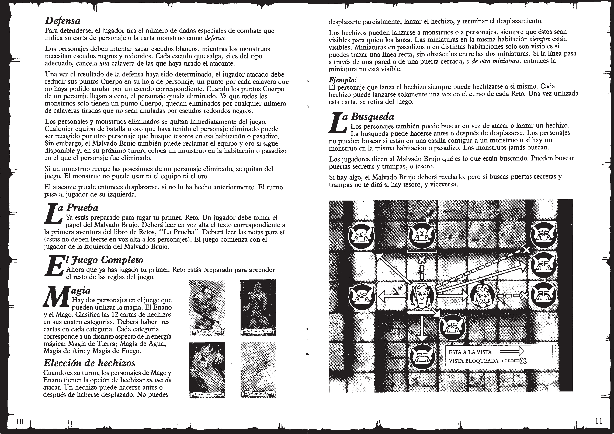
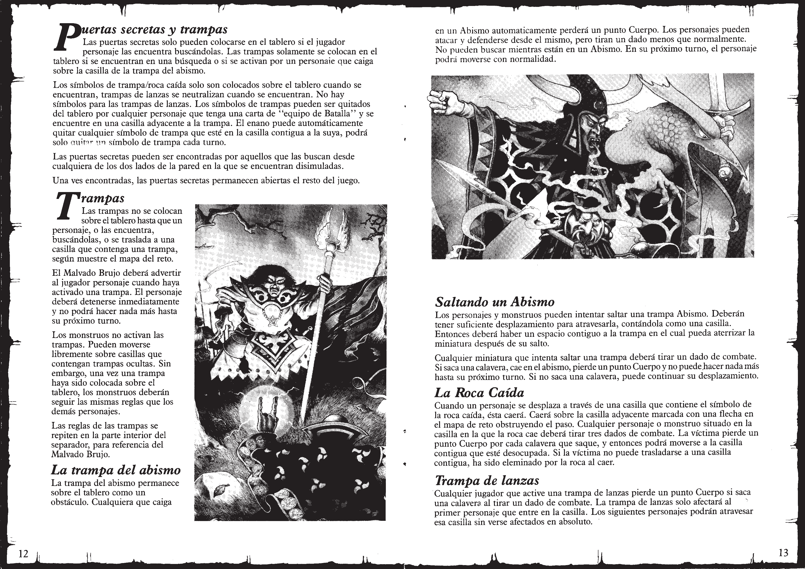
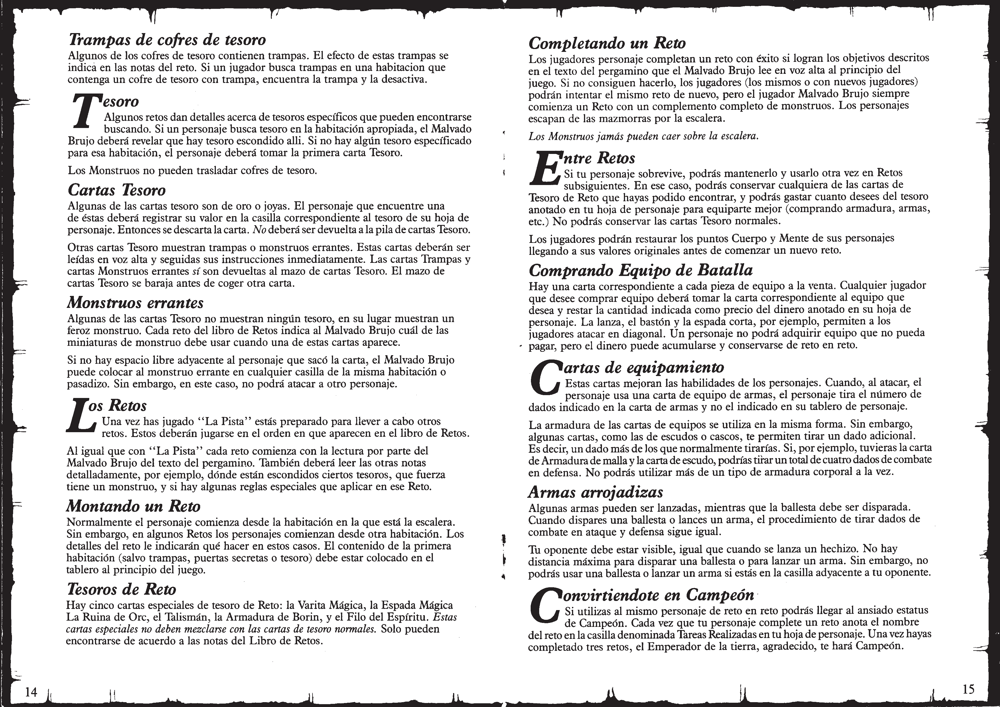
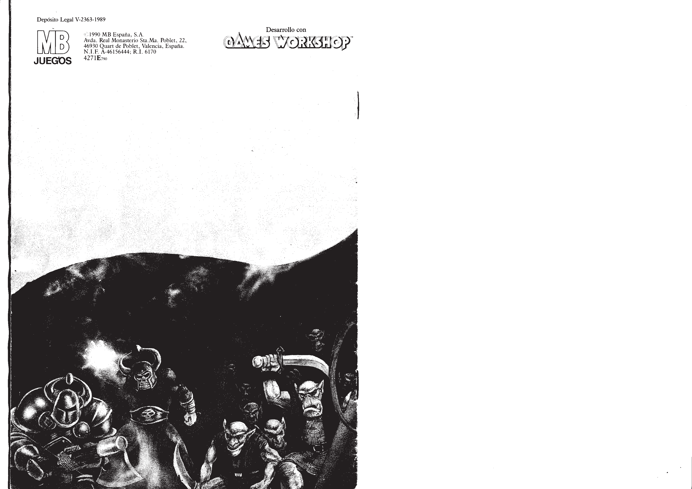

# 📖 Manual de Instrucciones

Este manual contiene las reglas básicas y el trasfondo del mundo de Heroquest. Aquí encontrarás todo lo necesario para empezar tu aventura, desde el movimiento de los héroes hasta las mecánicas de combate y búsqueda.

---

## 📜 Portada y Contenido

---

## 💡 Resumen de Reglas
1. **Turno del Héroe:** Mover (2D6) y realizar una acción (Atacar, Lanzar Hechizo, Buscar Tesoro, Buscar Trampas/Puertas Secretas).
2. **Combate:** Atacante tira dados de ataque (calaveras impactan). Defensor tira dados de defensa (escudos blancos para héroes, escudos negros para monstruos).
3. **Puntos de Cuerpo y Mente:** Si tus Puntos de Cuerpo llegan a 0, el héroe muere (a menos que use una poción o hechizo de resurrección inmediatamente).

---

## ⚖️ Reglas Avanzadas (Remake V1)

### 🧪 Envenenamiento (Poisoning)
Ciertos monstruos y trampas pueden infligir el estado de **Envenenado**.
- **Efecto:** El héroe pierde 1 Punto de Cuerpo al inicio de cada turno hasta que se cure con un antídoto o hechizo específico.
- **Acumulación:** El veneno no se acumula, pero reinicia su duración si se recibe de nuevo.

### 🕳️ Trampas de Pozo Ocupado
- **Regla:** Un héroe puede intentar saltar sobre un foso que ya contiene a otro héroe o monstruo, pero la tirada de dados requerida es más difícil (se resta -1 al movimiento).

### 📜 Pergaminos de Hechizos (Spell Scrolls)
- Los pergaminos permiten a héroes no mágicos lanzar hechizos, pero el pergamino se consume tras su uso.
- Un héroe puede llevar un máximo de 2 pergaminos a la vez.

### 🏆 Convertirse en Campeón del Imperio
- Se han revisado los requisitos para obtener el título de Campeón, permitiendo acceder a equipo exclusivo y reduciendo el coste de ciertos mercenarios.

---
*Material generado en base a los manuales clásicos y el sistema HeroQuest Remake V1.*
